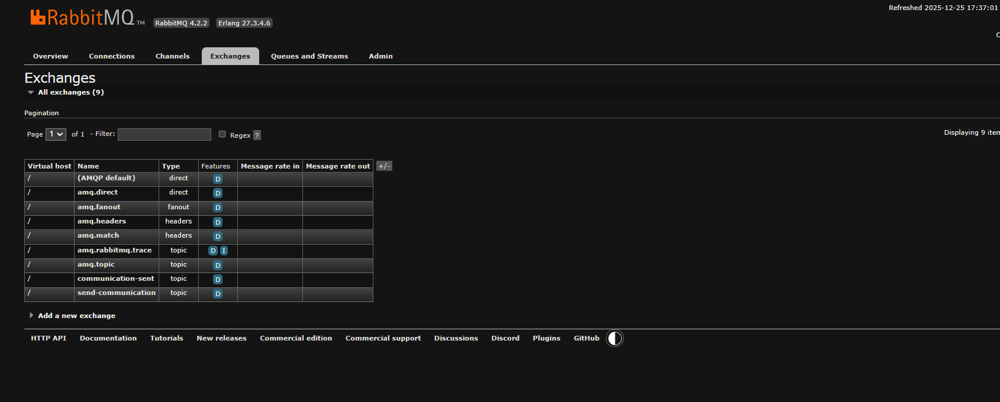
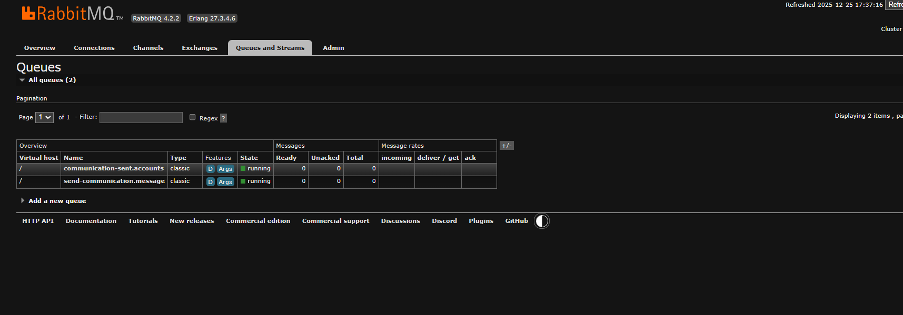

# 📡 Event-Driven Microservices with RabbitMQ, Spring Cloud Function & Spring Cloud Stream
           

This section focuses on building **loosely coupled, scalable, and resilient microservices** using **event-driven architecture**.  
We solve key challenges of synchronous REST-based systems by introducing **asynchronous messaging**.

---

## 🚧 Challenges in Traditional Synchronous Microservices

### ❌ Challenge 1: Temporal Coupling
**Temporal coupling** means:
- The **caller service** and **callee service** must be **available at the same time**
- If one service is down, slow, or overloaded → the entire flow fails

📌 Example:  
Accounts Service → calls Loans Service → calls Cards Service  
If Loans Service is down → Accounts request fails ❌

### ✅ Solution
👉 Use **asynchronous, event-driven communication**
- Services communicate via **events**
- No direct dependency on availability
- Improves resilience and scalability

---

### ❌ Challenge 2: Tight Coupling via Synchronous Communication
- REST APIs create **hard dependencies**
- Changes in one service often break others
- Scaling becomes difficult

### ✅ Solution
👉 **Asynchronous Messaging**
- Services exchange messages via a **message broker**
- Producers and consumers are **independent**
- No direct knowledge of each other

---

### ❌ Challenge 3: Building Scalable Systems
- Synchronous systems block threads
- Limited throughput
- Difficult to scale independently

### ✅ Solution
👉 **Event-Driven Microservices**
- Non-blocking communication
- Horizontal scaling
- Better fault tolerance

---

## 🎯 Problems Solved Using Event-Driven Architecture

- Avoids temporal coupling  
- Eliminates tight service dependencies  
- Improves scalability  
- Prevents cascade failures  
- Enhances fault tolerance  
- Enables async communication  
- Supports extensibility  

---

## 🔔 What Is Event-Driven Architecture?

**Event-Driven Architecture (EDA)** is a design approach where services communicate by **publishing and listening to events** instead of calling each other directly.

An **event** represents something that has already happened in the system.

📌 Key idea:  
> “Tell the system what happened, not what to do”

In EDA:
- One service produces an event
- Other services react to it asynchronously
- Services remain loosely coupled and independent


---

## 🧠 Event-Driven Communication Models

### 1️⃣ Publish / Subscribe (Pub/Sub) Model  
### 2️⃣ Event Streaming Model  

---

## 1️⃣ Publish / Subscribe (Pub/Sub) Model

### 📘 Definition
- A producer publishes events
- Multiple subscribers receive them
- Producer does not know consumers

### 🔑 Characteristics
- Loose coupling
- One-to-many communication
- Broker handles routing

📌 Tools: RabbitMQ, ActiveMQ, Google Pub/Sub

---

## 2️⃣ Event Streaming Model

### 📘 Definition
- Events are written to a log (stream)
- Consumers read events at their own pace
- Events are retained for replay

### 🔑 Characteristics
- Persistent storage
- Replay capability
- Strong ordering

📌 Tools: Apache Kafka, Amazon Kinesis

---

## ⚖️ Pub/Sub vs Event Streaming

| Aspect | Pub/Sub | Event Streaming |
|------|--------|----------------|
| Message retention | Short-lived | Long-term |
| Replay support | ❌ No | ✅ Yes |
| Ordering | Limited | Strong |
| Consumption | Push-based | Pull-based |
| Scalability | Medium | High |
| Use case | Notifications | Analytics |
| Tools | RabbitMQ | Kafka |

---

## 🐇 RabbitMQ for Pub/Sub Model

- RabbitMQ is an open-source message broker that enables asynchronous communication between distributed systems by acting as an intermediary that receives, routes, stores, and delivers messages between producers and consumers.
---

## 🧩 Core RabbitMQ Components

### 1️⃣ Producer (Publisher)
- Sends messages
- No knowledge of consumers

### 2️⃣ Message Broker (RabbitMQ)
- Routes messages
- Decouples services

### 3️⃣ Exchange
- Receives messages from producer
- Routes them to queues

### 4️⃣ Queue
- Stores messages
- Consumers read from here

### 5️⃣ Consumer (Subscriber)
- Processes messages asynchronously


---

## 🔄 RabbitMQ Message Flow – Step by Step (Detailed)

RabbitMQ enables **asynchronous, decoupled communication** between microservices using messages.  
Below is the complete flow explaining how a message travels through RabbitMQ.

---

### 1️⃣ Producer Sends Message to Exchange
The **Producer (Publisher Service)** creates a message (event/data) and sends it to RabbitMQ.

- The message is **never sent directly to a queue**
- It is always published to an **Exchange**
- Producer does not know who will consume the message

➡️ Producer only knows **Exchange name + Routing Key**

---

### 2️⃣ Exchange Applies Routing Rules
The **Exchange** receives the message and decides how to route it.

Routing decision is based on:
- Exchange type (Direct / Topic / Fanout / Headers)
- Routing key
- Bindings between exchange and queues

📌 Exchange does **not store messages**  
📌 It only routes messages

---

### 3️⃣ Message Routed to Queue(s)
After routing rules are applied:
- Message is delivered to **one or more queues**
- Same message can be copied to multiple queues (Pub/Sub)
- Or routed to a single queue (Point-to-Point)

➡️ This enables **event broadcasting**

---

### 4️⃣ Queue Stores the Message
The **Queue** safely stores the message until a consumer is ready.

- Acts as a buffer
- Message remains even if consumer is down
- Supports durability & persistence

➡️ Queue ensures **reliability and fault tolerance**

---

### 5️⃣ Consumer Listens to Queue
A **Consumer (Subscriber Service)** is attached to the queue.

- Listens continuously or consumes when message arrives
- Multiple consumers can listen to same queue
- Load is distributed automatically

➡️ Enables **horizontal scaling**

---

### 6️⃣ Consumer Processes the Message
Once message is received:
- Business logic is executed
- Event is handled asynchronously
- Database or downstream services are updated

➡️ Producer is NOT blocked during processing

---

### 7️⃣ Acknowledgment Sent Back
After successful processing:
- Consumer sends **ACK**
- RabbitMQ removes message from queue

If processing fails:
- Message can be re-queued
- Or moved to **Dead Letter Queue (DLQ)**


---

### ✅ Benefits of Using RabbitMQ

RabbitMQ provides multiple benefits that make it ideal for **event-driven and asynchronous microservices architectures**.

#### 🌟 Key Benefits

- **Asynchronous Communication**  
  Services do not wait for each other, improving responsiveness.

- **Loose Coupling**  
  Producers and consumers are independent and unaware of each other.

- **Improved Scalability**  
  Multiple consumers can process messages in parallel.

- **Fault Tolerance**  
  Messages are safely stored even if consumers are temporarily down.

- **Reliable Message Delivery**  
  Supports acknowledgements, retries, and persistence.

- **Traffic Buffering**  
  Handles traffic spikes by queueing messages.

- **Multiple Messaging Patterns**  
  Supports pub/sub, fanout, topic, and direct messaging.

- **Event-Driven Architecture Support**  
  Enables real-time event processing between microservices.

---

## ☁️ What Is Spring Cloud Function?

### 📘 Definition
Spring Cloud Function provides a **functional programming model** for event-driven microservices.

It allows developers to:
- Write logic as functions
- Avoid infrastructure boilerplate
- Deploy to messaging systems or serverless platforms

Supported platforms:
- RabbitMQ
- Kafka
- HTTP
- AWS Lambda
- Azure Functions

---

## 🧠 Functional Interfaces in Spring Cloud Function

### 1️⃣ Supplier<T>
Produces data without input.

```java
Supplier<String> supplier();
```

📌 Use case: Publishing events

---

### 2️⃣ Function<T, R>
Transforms input to output.

```java
Function<Order, Invoice> function();
```

📌 Use case: Data transformation

---

### 3️⃣ Consumer<T>
Consumes data without returning anything.

```java
Consumer<PaymentEvent> consumer();
```

📌 Use case: Event processing

---

## 🚀 Why Use Spring Cloud Function + RabbitMQ?

- Clean business logic
- Loose coupling
- Platform independence
- Asynchronous communication
- Cloud-native design
- Production-ready microservices

---
## 🌊 What Is Spring Cloud Stream?

**Spring Cloud Stream** is a framework built on top of **Spring Boot** that helps developers build **event-driven microservices** using messaging systems like **RabbitMQ** and **Kafka**.

It allows microservices to **produce and consume events** without writing low-level broker-specific code.

📌 In short:  
> Spring Cloud Stream connects your business logic to messaging systems in a simple, declarative way.

---

## 🎯 Why Do We Need Spring Cloud Stream?

In event-driven systems:
- Services must communicate asynchronously
- Messaging brokers (RabbitMQ/Kafka) have complex APIs
- Tight coupling with broker code reduces flexibility

Spring Cloud Stream solves this by:
- Abstracting messaging infrastructure
- Removing broker-specific code
- Letting developers focus on **business logic only**

---

## 💡 Main Idea of Spring Cloud Stream

The core idea is **separation of concerns**:

- ❌ Business logic should NOT know about exchanges, queues, topics
- ✅ Messaging infrastructure should be handled by framework

Spring Cloud Stream:
- Automatically connects your app to message brokers
- Handles serialization, routing, retries, and acknowledgements
- Allows switching brokers without code changes

📌 Write once → Run with RabbitMQ or Kafka

---

## 🧱 Core Building Blocks of Spring Cloud Stream

### 1️⃣ Destination Binders

A **binder** is a bridge between:
- Spring Cloud Stream
- Messaging system (RabbitMQ, Kafka)

Examples:
- RabbitMQ Binder
- Kafka Binder

📌 Binder responsibility:
- Create exchanges / topics
- Create queues
- Manage connections to broker

---

### 2️⃣ Destination Bindings

**Destination Binding** connects:
- A function (Supplier / Function / Consumer)
- To a messaging destination (queue/topic)

Binding defines:
- Where messages are sent
- Where messages are received from

📌 Example:
- Producer → exchange
- Consumer → queue

---

### 3️⃣ Message

A **message** is the actual data sent between services.

It contains:
- Payload (business data)
- Headers (metadata)

Messages are:
- Serialized automatically (JSON by default)
- Transported asynchronously
- Broker-managed (durability, retries, acknowledgments)

---

## 🔁 How Spring Cloud Stream Works (High Level)

1. Business logic produces or consumes data
2. Spring Cloud Stream converts data into messages
3. Binder sends message to broker
4. Broker routes message to destination
5. Consumer receives and processes message

📌 Producer and Consumer never communicate directly


---

# 📢 Implementing Event-Driven Communication Using Spring Cloud Stream & RabbitMQ

This section demonstrates how **event-driven microservices** are implemented using  
**Spring Cloud Function + Spring Cloud Stream + RabbitMQ**, enabling **asynchronous, loosely coupled communication** between services.

---

## 🧩 Step 1: Create Message Service

A new **Message Service** was created using **Spring Initializr** with the following dependencies:

- Spring Cloud Function
- Spring Cloud Stream
- Spring Cloud Stream Binder RabbitMQ
- Spring Cloud Function Web
- Spring Boot Test
- Spring Cloud Stream Test Binder

---

## 📦 Message Service Dependencies (pom.xml)

```xml
<dependency>
    <groupId>org.springframework.cloud</groupId>
    <artifactId>spring-cloud-stream</artifactId>
</dependency>

<dependency>
    <groupId>org.springframework.cloud</groupId>
    <artifactId>spring-cloud-stream-binder-rabbit</artifactId>
</dependency>

<dependency>
    <groupId>org.springframework.boot</groupId>
    <artifactId>spring-boot-starter-test</artifactId>
    <scope>test</scope>
</dependency>

<dependency>
    <groupId>org.springframework.cloud</groupId>
    <artifactId>spring-cloud-stream-test-binder</artifactId>
    <scope>test</scope>
</dependency>
```

---

## 📄 Step 2: Create DTO (Message Payload)

Inside the `dto` package, a DTO was created to represent the message sent between services.

```java
public record AccountsMsgDto(
        Long accountNumber,
        String name,
        String email,
        String mobileNumber
) {
}
```

📌 This DTO acts as the **event payload** shared across microservices.

---

## ⚙️ Step 3: Create Spring Cloud Functions

Inside a `functions` package, a `MessageFunctions` class was created.  
It defines **two Spring Cloud Functions**: `email` and `sms`.

```java
public class MessageFunctions {

    private static final Logger log = LoggerFactory.getLogger(MessageFunctions.class);

    @Bean
    public Function<AccountsMsgDto, AccountsMsgDto> email() {
        return accountsMsgDto -> {
            log.info("Sending email with the details : {}", accountsMsgDto);
            return accountsMsgDto;
        };
    }

    @Bean
    public Function<AccountsMsgDto, Long> sms() {
        return accountsMsgDto -> {
            log.info("Sending sms with the details : {}", accountsMsgDto);
            return accountsMsgDto.accountNumber();
        };
    }
}
```

📌 **Key Concept**
- Functions contain **only business logic**
- Messaging infrastructure is handled by Spring Cloud Stream

---

## 🔗 Step 4: Function Chaining Configuration

The two functions are chained using **email | sms** so they execute sequentially.

### 📄 Message Service application.yml

```yaml
server:
  port: 9010

spring:
  application:
    name: message

  cloud:
    function:
      definition: email|sms

    stream:
      bindings:
        emailsms-in-0:
          destination: send-communication
          group: ${spring.application.name}

        emailsms-out-0:
          destination: communication-sent

  rabbitmq:
    host: localhost
    port: 5672
    username: guest
    password: guest
    connection-timeout: 10s
```

📌 Flow:
- Input Queue → `send-communication`
- Functions executed → `email` ➜ `sms`
- Output Queue → `communication-sent`

---

## 🏦 Step 5: Configure Accounts Service as Event Producer

The **Accounts Service** publishes events whenever a new account is created.

### 📄 Accounts Service DTO

```java
public record AccountsMsgDto(
        Long accountNumber,
        String name,
        String email,
        String mobileNumber
) {
}
```

---

## 🧠 Step 6: Publish Event from Accounts Service

Inside `AccountServiceImpl`, an event is published **after successful account creation**.

```java
@Override
public void createAccount(CustomerDto customerDto) {

    Customer customer = CustomerMapper.mapToCustomer(customerDto, new Customer());

    Optional<Customer> optionalCustomer =
            customerRepository.findByMobileNumber(customerDto.getMobileNumber());

    if (optionalCustomer.isPresent()) {
        throw new CustomerAlreadyExistsException(
                "Customer already registered with given mobileNumber " + customerDto.getMobileNumber()
        );
    }

    Customer savedCustomer = customerRepository.save(customer);
    Accounts savedAccount = accountsRepository.save(createNewAccount(savedCustomer));

    sendCommunication(savedAccount, savedCustomer);
}
```

---

## 📤 Step 7: Send Event Using StreamBridge

```java
private void sendCommunication(Accounts account, Customer customer) {

    var accountsMsgDto = new AccountsMsgDto(
            account.getAccountNumber(),
            customer.getName(),
            customer.getEmail(),
            customer.getMobileNumber()
    );

    log.info("Sending Communication request for the details: {}", accountsMsgDto);

    var result = streamBridge.send("sendCommunication-out-0", accountsMsgDto);

    log.info("Is the Communication request successfully triggered ? : {}", result);
}
```

📌 **Why StreamBridge?**
- Sends messages dynamically
- No tight coupling to RabbitMQ
- Producer doesn’t know the consumer

---

## 🔁 End-to-End Event Flow

1️⃣ Account created in **Accounts Service**  
2️⃣ Event published to `send-communication`  
3️⃣ **Message Service** consumes the event  
4️⃣ `email` function executes  
5️⃣ `sms` function executes  
6️⃣ Final event published to `communication-sent`  

---

## ✅ What This Implementation Achieves

- ✔️ Avoids temporal coupling  
- ✔️ Enables asynchronous communication  
- ✔️ Implements event-driven microservices  
- ✔️ Improves scalability and fault tolerance  
- ✔️ Decouples producers and consumers  

---

## 🐇 RabbitMQ Setup & Verification (AMQP)

After implementing **event-driven communication using Spring Cloud Stream and RabbitMQ**, the next step was to **run RabbitMQ locally and verify message flow** through the RabbitMQ Management Console.


## 🚀 Running RabbitMQ Using Docker

RabbitMQ was started using the official **RabbitMQ Management** Docker image:

```bash
docker run -it --rm --name rabbitmq \
-p 5672:5672 \
-p 15672:15672 \
rabbitmq:4-management
```

### 🔑 What This Does
- `5672` → AMQP port (used by applications)  
- `15672` → Management UI port  
- Management plugin enabled by default  

### 🌐 Accessing RabbitMQ Management Console
Once the container was running, the RabbitMQ dashboard was accessed at:

```
http://localhost:15672/
```

**Default credentials:**
- Username: `guest`  
- Password: `guest`  

---

## 🔁 Verifying Exchanges (Event Routing)

📌 **Screenshot: Exchanges View**  
This screenshot shows the exchanges automatically created by Spring Cloud Stream based on application configuration.

**Observed Exchanges:**
- `send-communication`  
- `communication-sent`  

 


➡️ These exchanges are used to route messages between microservices.

---

## 📬 Verifying Queues (Message Storage)

📌 **Screenshot: Queues View**  
This screenshot confirms that queues were successfully created and bound to exchanges.

**Observed Queues:**
- `send-communication.message`  
- `communication-sent.accounts`  



➡️ Each queue represents a consumer group subscribed to an exchange.

---

## 🧠 What This Confirms

✔️ RabbitMQ broker is running successfully  
✔️ Spring Cloud Stream auto-created exchanges  
✔️ Queues are bound correctly  
✔️ Message producer and consumer are connected  
✔️ Event-driven communication is working end-to-end  

✅ This validates the successful integration of RabbitMQ with Spring Cloud Stream in the EazyBank microservices architecture


---
## 📝 Key Learnings (Short Version)

- Event-Driven Architecture (EDA) concepts  
- Solving temporal & tight coupling issues with async messaging  
- RabbitMQ basics: exchanges, queues, routing, producer & consumer  
- Pub/Sub vs Event Streaming differences  
- Spring Cloud Function: Supplier, Function, Consumer  
- Spring Cloud Stream: binders, bindings, message flow  
- Event publishing from Accounts Service using StreamBridge  
- Function chaining (email | sms) for sequential processing  
- Running & verifying RabbitMQ via Docker and Management UI  
- Asynchronous communication patterns & benefits  
- Building loosely coupled, scalable, fault-tolerant microservices  


